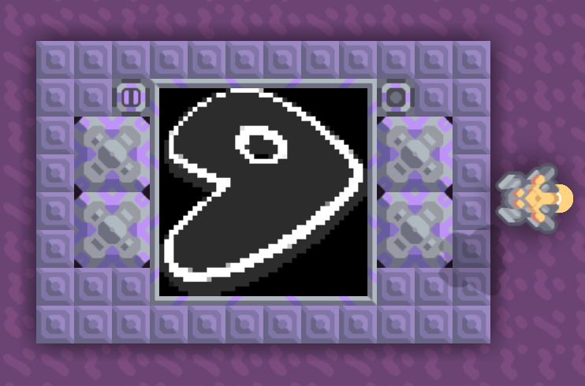
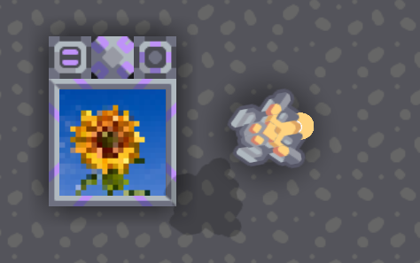
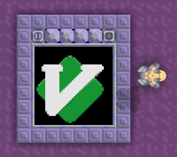

  
  <h1>Mindustry image generator</h1> 

This is a web app used to convert an image into code for a Mindustry Micro Processor, so that you can print images on logic displays in the game. You need to have Mindustry 6.0. To use this, go to [the github.io page](https://r4v10l1.github.io/mindustry-image-generator/). This page also explains how to use it.

#

This is a fork of [sudobeans/mindustry-image-generator](https://github.com/sudobeans/mindustry-image-generator), but instead of using a [small display](https://sudobeans.github.io/mindustry-image-generator/), I use the bigger one with 4 processors.
